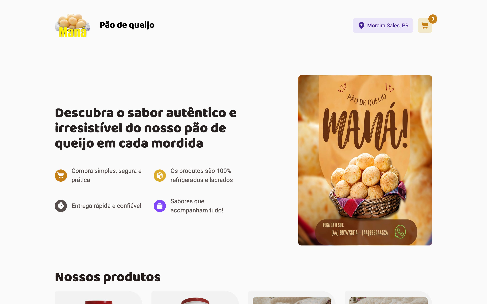
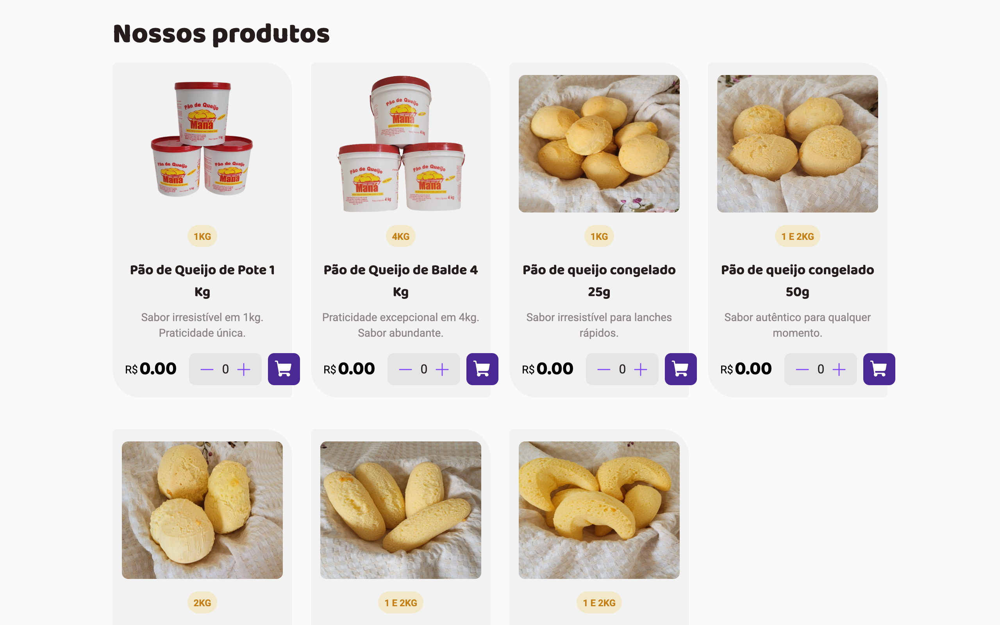
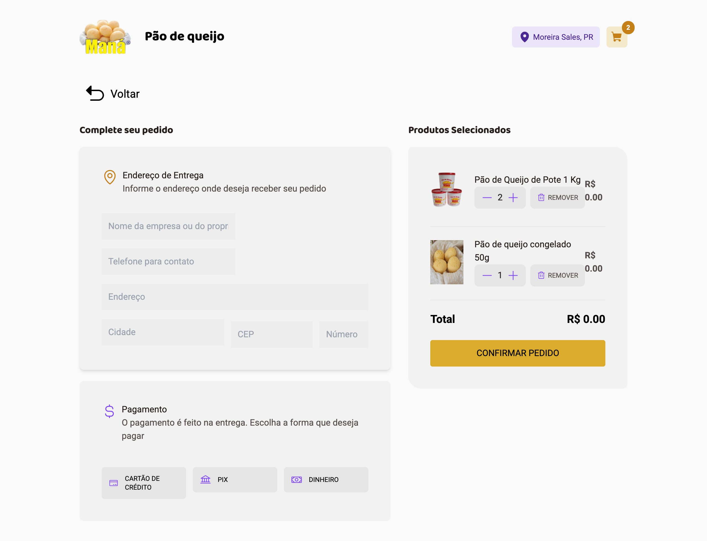
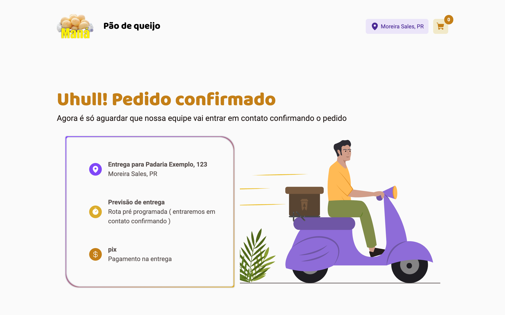

# Maná Pão de Queijo

[English](README.md) · **Português**

> Site de pedidos da Maná, fabricante de pão de queijo em Moreira Sales (PR): o cliente escolhe os produtos, monta o carrinho e envia o pedido, que chega por e-mail e é pago na entrega.



## Sobre

O site recebe pedidos sem backend e sem pagamento online. O catálogo fica no código, o carrinho fica no navegador e o checkout manda o pedido por e-mail para a empresa via [EmailJS](https://www.emailjs.com/). Depois a equipe entra em contato com o cliente para confirmar, e o pagamento é feito na entrega.

É um app Next.js (Pages Router), com Redux Toolkit no carrinho, React Hook Form com Zod no formulário de checkout e testes em Jest com React Testing Library.

## Funcionalidades

- **Catálogo de produtos**: sete produtos (pote de 1 kg, balde de 4 kg, pão de queijo congelado em três tamanhos e dois tipos de chipa), cada um com foto, etiquetas de tamanho, descrição e seletor de quantidade.
- **Carrinho de compras**: adicionar um produto que já está no carrinho soma a quantidade. No checkout dá para mudar a quantidade ou remover itens, e o contador no cabeçalho mostra quantos produtos diferentes há no carrinho.
- **O carrinho sobrevive ao recarregar a página**: ele fica salvo no `localStorage` com `redux-persist`.
- **Formulário de checkout validado**: nome da empresa ou do proprietário, telefone, endereço, cidade, CEP (8 dígitos) e número, todos conferidos por um schema Zod antes de o pedido sair.
- **Pagamento na entrega**: o cliente escolhe cartão de crédito, PIX ou dinheiro. Nada é cobrado online.
- **Pedido por e-mail**: ao enviar, o pedido sai pelo EmailJS com os dados do cliente, cada item com a sua quantidade e o total.
- **Página de confirmação**: mostra o nome, a cidade e a forma de pagamento, e avisa que a equipe vai entrar em contato para confirmar.
- **Feedback e estados vazios**: toasts ao adicionar itens e em caso de erro, e uma tela de carrinho vazio com um botão para voltar aos produtos.

## Telas

| Lista de produtos | Checkout |
| --- | --- |
|  |  |



Todos os preços estão como `0` em `src/utils/CardsContent.ts`, por isso as telas mostram R$ 0.00. O pedido do print de confirmação usa dados de teste inventados.

## Tecnologias

- **Frontend:** Next.js 13 (Pages Router), React 18, TypeScript 5, Tailwind CSS 3
- **Estado:** Redux Toolkit, redux-persist
- **Formulários:** React Hook Form, Zod
- **Outras bibliotecas:** EmailJS (e-mail do pedido), react-toastify (toasts), next-seo (meta tags), Phosphor icons
- **Testes:** Jest 29, React Testing Library
- **Lint:** ESLint com `@rocketseat/eslint-config`

## Como rodar

### Pré-requisitos

- Node.js e npm (testado com Node.js 24)

### Instalação

```bash
git clone https://github.com/giovaniocan/pq-mana.git
cd pq-mana
npm install
npm run dev
```

Abra http://localhost:3000.

Para o build de produção, rode `npm run build` e depois `npm run start`.

Os pedidos são enviados pelo EmailJS. Para recebê-los, crie o seu próprio service e template no EmailJS e configure-os em `src/hooks/SendEmailFunction.ts`.

O repositório também tem um `db.json` e o script `npm run server`, que servem os produtos com `json-server` na porta 3001. Eles eram para uma API planejada; o código que leria dela está comentado em `src/pages/home/index.tsx`, então as páginas não os usam.

## Testes

```bash
npm test
```

43 testes em 12 suítes, com Jest e React Testing Library. Cobrem os componentes, o reducer do carrinho e as páginas inicial, de checkout e de confirmação.

## Estrutura do projeto

```
src/
├── pages/         # rotas: / (início), /checkout, /success
├── components/    # cabeçalho, início (intro + lista de produtos), checkout, confirmação
├── redux/         # store, slice do carrinho persistido e selectors
├── lib/           # schema Zod do formulário de checkout
├── hooks/         # envio pelo EmailJS e helper de toast
├── utils/         # catálogo de produtos
└── pages-tests/   # testes das páginas
public/            # logo, banner e fotos dos produtos
```
